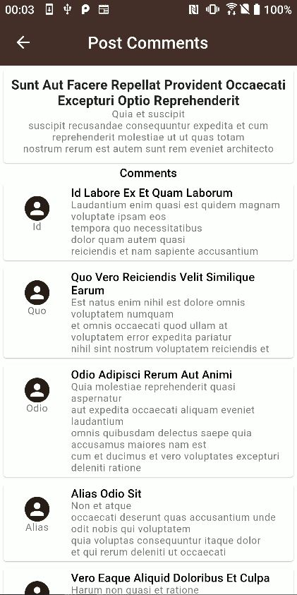

# bloc_app_example with clean architecture 

## This is a show case project that include implementations of:

* [x] Use of BLOC state management
* [x] Clean Architecture 
* [x] Dependency Injection with Get_it
* [x] Work with public API using Http
* [x] Pagination
* [x] Local Storage and caching 
* [ ] unit tests
* [ ] widget tests
* [ ] integration tests
* [ ] migrate caching to hydrated bloc
* [ ] implementing bloc concurrency

This show case project fetches 10 Posts from [Public API](https://jsonplaceholder.typicode.com/) on app start and cache them, on user scroll +10 posts will be fetched. 

fetched posts are clickable and shows full posts data and comments related to post on 2nd screen on click

Basic Theming implemented using [flex_color_scheme](https://pub.dev/packages/flex_color_scheme) package

<table>
  <tr>
    <td style="padding:10px">
      
    </td>
    <td style="padding:10px">
      
    </td>
  </tr>
</table>

### Contact Me
- LinkedIn: [Abdulaziz Aboujib](https://www.linkedin.com/in/abdul-aziz-aboujib-5a34461b2/)
- Email: Abdulaizizz.94@gmail.com
